# Lab9_DB_SpringSecurity
Task

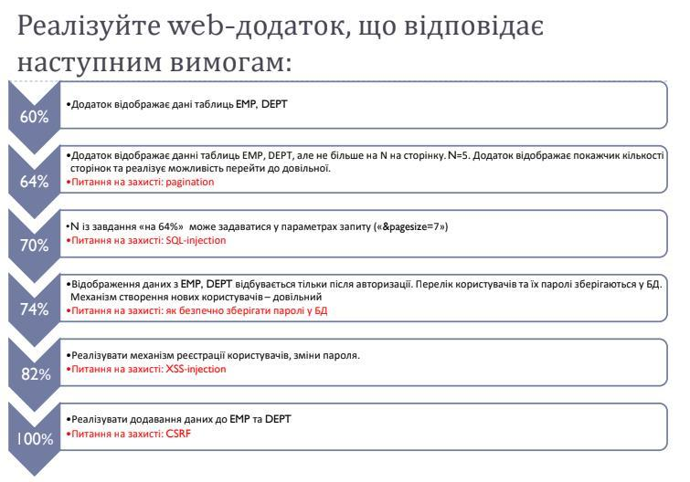

Created by using 
- Spring Core/Boot/Data/MVC/Security
- Mustache
- JQuery
- PostgreSQL (not include to repository)
- Maven
on IntelliJ idea Ultimate (JB)

How it's work

0 Compiled project (30MB)
https://www.dropbox.com/s/3dz595do8nbejtw/lab9-1.0-SNAPSHOT.jar?dl=0

Change settings connect to DB: 

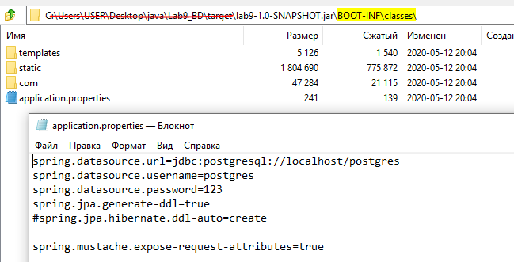

Tables emp and dept must be created, for example using init.sql

And simply run (cmd):
java -jar lab9-1.0-SNAPSHOT.jar

1 Starting application:

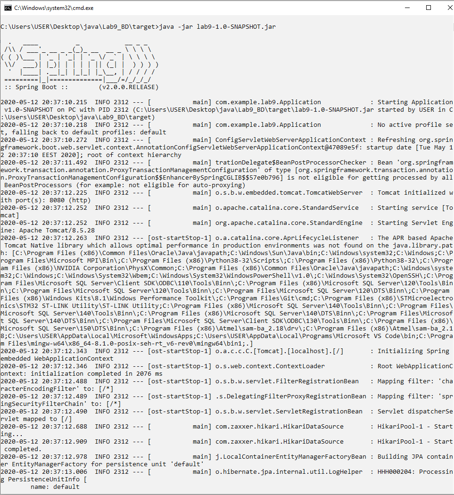

Completed run:

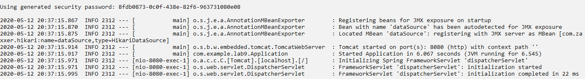

2. goto localhost:8080

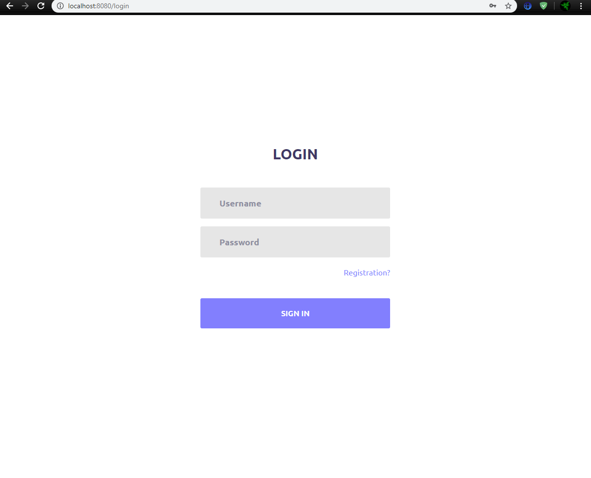

3. Firstly registration:

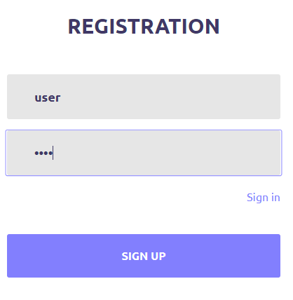

4 Login user account:

5 Head page after sign in:

6 Show first records table emp:

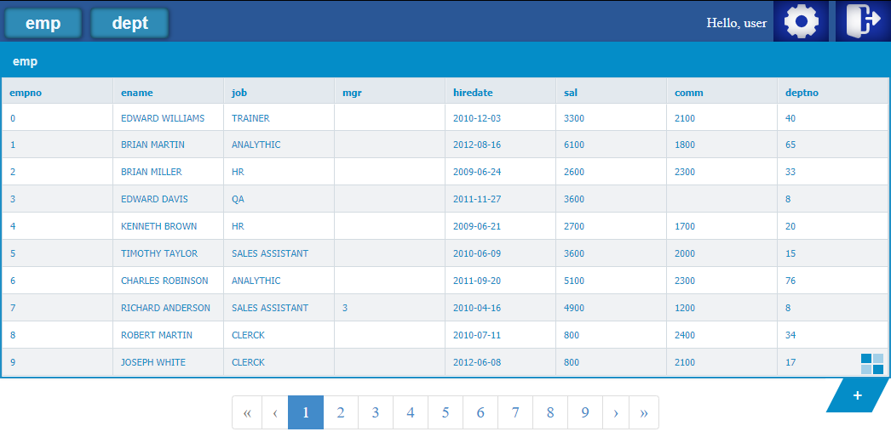

7 set pagesize=20 and go to prelast page:

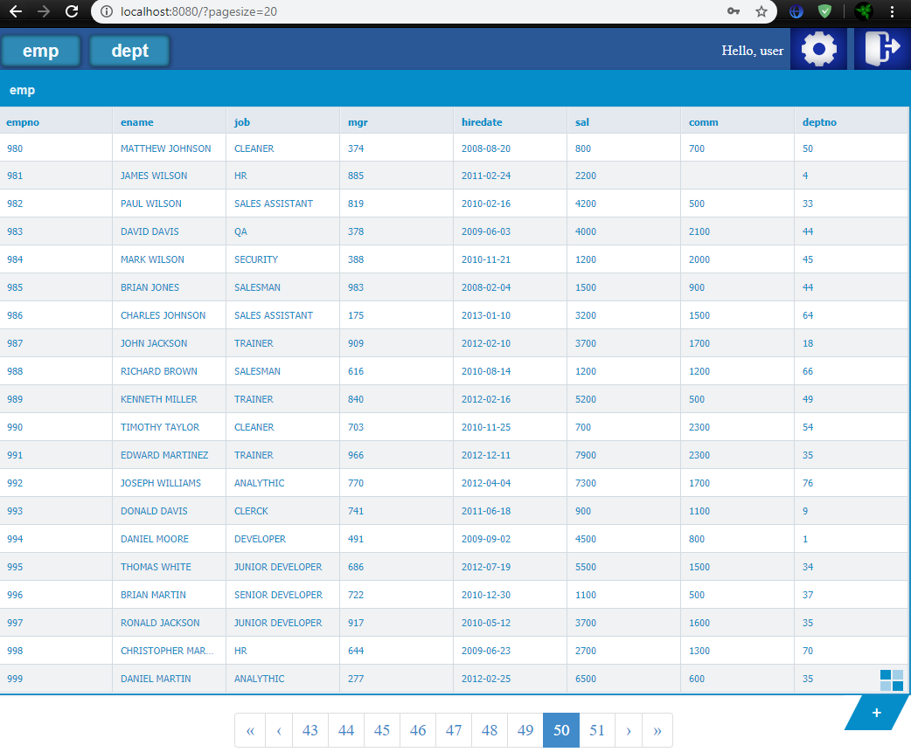

8 First page shows 20 records:

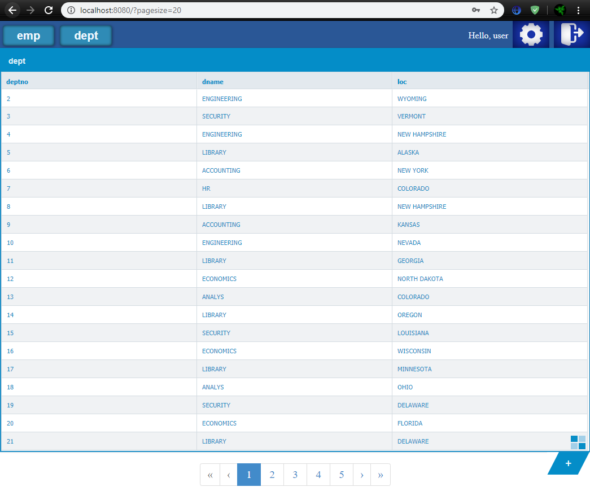

9 Press "Plus" and show modal form adding new records (invalid fields lighting lightcoral color)

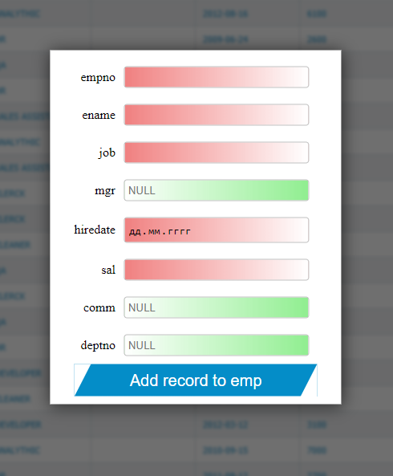

10 write valid values and add record:

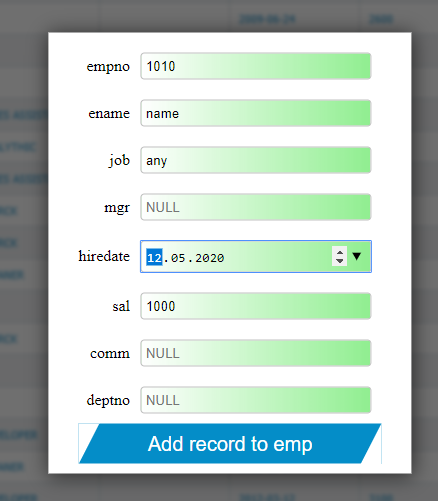

11 seen success result and our records on last page 
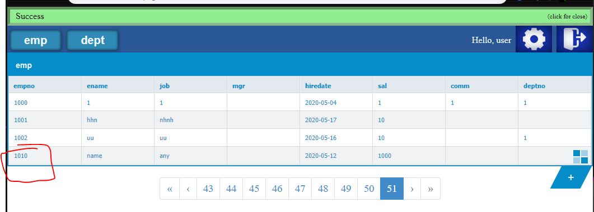

12 repeat empno value: 
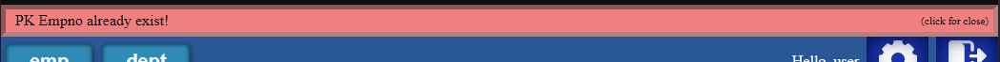

13 try using not exist deptno

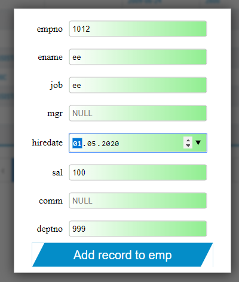

result:

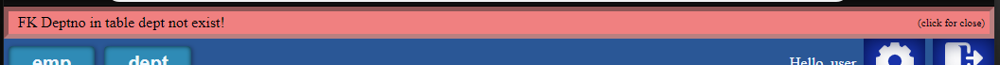

check dept:

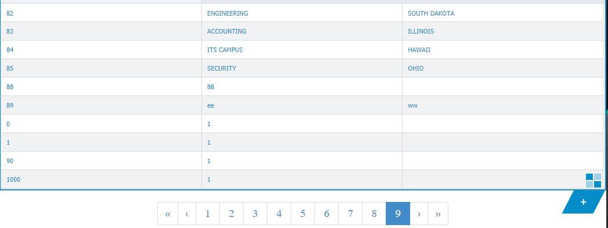

14 change password form

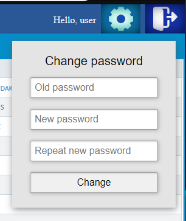

white invalid old password:

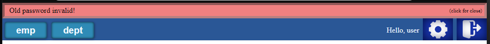

write not equal new password:

write correct password:

